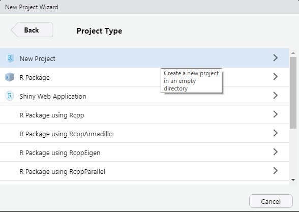

#### Intro to Coding

Welcome to the class!

Learning (or re-learning) how to program can feel like an intimidating learning curve.
Congrats on taking the first step!
Before we delve into technical topics, let's talk a little about coding in general.

##### It's okay to make mistakes

Errors and broken code are not only part of the learning process, they're part of the coding process.
If you think your code is running perfectly on the first try, you probably didn't test it thoroughly enough.
It can be frustrating and discouraging when you can't get your code to work the way you want it to, but getting stuck doesn't make you a bad programmer.
Try to approach broken code as a puzzle and a learning opportunity.

##### Use the resources available to you

As the saying goes,

> Good coders write good code; great coders steal great code.

Google and Stack Overflow are great resources when you don't know off the top of your head how to do something.
And reach out to your colleagues too - there's no reason to waste time writing code that someone else has already written!
Just give credit where credit is due, and take some time to make sure you understand what the copied code does.
And especially don't hesitate to reach out to more experienced colleagues with questions.

#### Intro to R & RStudio

##### About R

R is a programming language that was originally developed by statisticians for statistical computing and graphics. R is free and open source, which means you will never need a paid license to use it,
and anyone who wants to can view the underlying source code and suggest fixes and improvements. Since its first official release in 1995, R remains one of the leading programming languages for statistics and data visualization,
and its capabilities continue to grow.  

Every programming language has strengths and weaknesses. We like R because:

  - It is great for statistics and data exploration
  - It is good at producing publication-quality plots and tables
  - There are many well-maintained add-ons (called _packages_) that add useful features to R (this website was built using the `rmarkdown` package)
  - R is well-documented, with many learning resources available whether you are a beginner or an advanced user
  

For more information on the history of R, visit the [R Project website](https://www.r-project.org/about.html).

##### About RStudio

RStudio is what's called an _integrated development environment_ (IDE). When you install R, it comes with a simple user interface that lets you write and execute code.
Writing code in this interface is kind of like doing word processing in Notepad: it's simple and straightforward, but soon you'll start wishing for more features.
This is where RStudio comes in. RStudio makes programming in R easier by color coding different types of code, autocompleting code, flagging mistakes (like spellcheck for code), and providing many useful tools with the push of a button or key stroke (e.g. viewing help info).  

When you open RStudio, you typically see 4 panes:  

  - **Source:**  
  This is where the code gets written. When you create a new script or open an existing one, it displays here.
  In the screenshot above, there's a script called bat_data_wrangling.R open in the source pane. Note that if you haven't yet opened or created a new script, you won't see this pane until you do.  
  The source pane will helpfully color-code your code to make it easier to read. It will also detect syntax errors (the coding equivalent of a grammar checker). These are flagged with a red "x" next to the line number
  and a squiggly line under the offending code.
  When you're ready to run all or part of your script:
    - Highlight the line(s) of code you want to run
    - Either click the "Run" button (top right of the source pane) or press **Ctrl+Enter**.
  At this point, the code gets sent to the console (the bottom left pane). You'll see your code appear in the console, and then you'll see the output if there is any.  

  - **Console:**  
  This is where the code actually runs. When you first open RStudio, the console will tell you the version of R that you're running (should be R 4.1.0 or greater).
  We talked above about how you can run a script at the console. You can also type code directly into the console and run it that way. That code won't get saved to a file, but it's a great way
  to experiment and test out lines of code before you add them to your script in the source pane.  
  The console is also where errors appear if your code breaks. Deciphering errors can be a challenge sometimes, but Googling them is a good place to start.  

  - **Environment/History/Connections:**  
    - **Environment:** This is where you can see what is currently in your _environment_. Think of the environment as temporary storage for objects - things like datasets and stored values - that you are using
    in your script(s). You can also click on objects and view them.  
    Remember that anything you see in your environment is temporary and it will disappear when you restart R. If there is something in your environment that you want to access in the future, make sure that
    your script is able to reproduce it (or save it to a file).
    - **History:** This shows the code you've run in the current session. It's not good to rely on it, but it can be a way to recover code you ran at the console and later realized you needed in your script.
    - **Connections:** This is one way to connect R to a database. We'll talk about this more later on.
    - **Git:** If you have installed Git on your computer, you may see a _Git_ tab. We won't talk much about it this week, but this is where you'll keep track of changes to your code. You are encouraged to attend the Git/GitHub session during Week 2 if you'd like to learn more!
    - **Tutorial:** This has some interactive tutorials that you can check out if you are interested.  
    

  - **Files/Plots/Packages/Help/Viewer:**
    - **Files:** This tab shows the files within your working directory (typically the folder where your current code project lives). More on this later.
    - **Plots:** This tab will show plots that you create.
    - **Packages:** This tab allows you to install, load, and update packages, and also view the help files within each package. This is kind of like the R equivalent of an app store. You can also do this with code.
    - **Help:** Allows you to search for and view documentation for packages that are installed on your computer.
    - **Viewer:** Shows HTML outputs produced by R Markdown, R Shiny, and some plotting and mapping packages.

##### Global Options

There are several settings in the Global Options that everyone should check to make sure we all have consistent settings.
Go to **Tools -> Global Options** and follow the steps below.

  1. Under the General tab, you should see that your R Version is [64-bit] and the version is R-4.1.0 or greater. If it's not, you probably need to update R. Let an instructor know if you have questions about this.
  1. Make sure you are not saving your environment. To do this, **uncheck** the **Restore .RData into your workspace at startup** option.  
  When this option is checked, R Studio saves your current working environment (the stuff in the Environment tab) when you exit. The next time you open R Studio, it restores that same environment.
  This seems like a good thing, but the whole point of using R is that your code should return the same results every time you run it.
  Clearing your environment every time you close RStudio forces you to run your code with a clean slate so that you can be sure that it will work for everyone, not just you and your specific environment.  
  If you sometimes work with huge datasets that take a long time to load and process, you may want to set **Save workspace to .RData on exit** to "Ask". When you close RStudio, it will ask you if you want to save your workspace image.
  If you have a huge dataset (or the products of a huge dataset) in your environment, select "Yes" and then run `load(".RData")` at the console the next time you open RStudio to restore everything.  
  
Most other settings are whatever you prefer, including everything in the Appearance window.

##### Starting a Project

When you're working on a code project it's important to stay organized. Keeping code, input data, and results together in one place will protect your sanity and the sanity of the person who inherits the project. 
R Studio **projects** help with this. Creating a new R Studio project for each new code project makes it easier to manage settings and file paths.  

Before we create a project, take a look at the **Console** tab. Notice that at the top of the console there is a folder path. That path is your current working directory.  

If you refer to a file in R using a *relative path*, for example `./data/my_data_file.csv`, R will look in your current working directory for a folder called `data` containing a file called `my_data_file.csv`. Using relative paths
is a good idea because the full path is specific to your computer and likely won't work on a different computer. But there's no guarantee that everyone has the same default R working directory. This is
where projects come in.  
Let's make a project for this class. Click File > New Project. In the window that appears, select **New Directory**, then select **Empty Project**. You will be prompted for a directory name.
This is the name of your project folder. For this class, call it `imd-r-training-intro`. Next, you'll select what folder to keep your project folder in. `Documents/R` is a good place to store all of your
R projects but it's up to you. When you are done, click on **Create Project**.  

 

 

some text here
