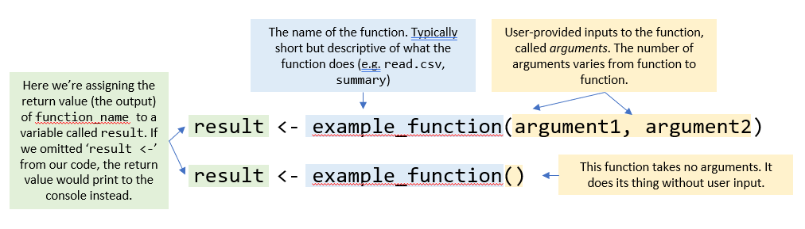

#### Variables and functions

##### Variables

Occasionally, it's enough to just run a line of code and display the result in the console. But typically the code we write is more complex than adding one plus one, and when we execute a line of code, we want to be able to store the result and use it later in the script. This is where variables come in. Variables allow you to assign a value (whether that's a number, a data table, a chunk of text, or any other type of data that R can handle) to a short, human-readable name. Anywhere you put a variable in your code, R will replace it with its value when your code runs.

R uses the `<-` symbol for variable assignment. If you've used other programming languages (or remember high school algebra), you may be tempted to use `=` instead. It will work, but there are subtle differences between `<-` and `=`, so you should get in the habit of using `<-`.

```{r VariableAssignment}
# the value of 12.098 is assigned to variable 'a'
a <- 12.098

# and the value 65.3475 is assigned to variable 'b'
b <- 65.3475

# we can now perform whatever mathematical operations we want using these two variables without having to repeatedly type out the actual numbers:

a*b

(a^b)/((b+a))

sqrt((a^7)/(b*2))
```

In the code above, we assign the variables `a` and `b` once. We can then reuse them as often as we want. This is helpful because we save ourselves some typing, reduce the chances of making a typo somewhere, and if we need to change the value of `a` or `b`, we only have to do it in one place.

Also notice that when you assign variables, you can see them listed in your Environment tab (top right pane). Remember, everything you see in the environment is just in R's temporary memory and won't be saved when you close out of RStudio.

All of the examples you've seen so far are fairly contrived for the sake of simplicity. Let's take a look at some code that everyone here will make use of at some point: reading data from a CSV.

##### Functions

It's hard to get very far in R without making use of *functions.* Think of a function as a black box that takes some kind of input (the *argument(s)*) from the user and outputs a result (the *return value*). Can you identify the functions in the above examples?



##### Using functions - reading data from CSV

The read.csv function is used to bring in a dataset from a CSV file, and it stores the data in one of the fundamental data structures in R: a data frame. `read.csv()` takes the file path to the CSV as input, and it outputs a data frame containing the data from the CSV. 

We'll get very familiar with data frames in this class, but for the moment just know that it's a table of data with rows and columns. Data frames are typically organized with rows being records or observations (e.g. sampling locations, individual critters, etc.), and columns being variables that characterize those observations (e.g., species, size, date collected, x/Y coordinates).
Once you have read the data in, you can take a quick look at its structure by typing the name of the variable it's stored in.

```{r ReadingData}
# read in the data from tree_growth.csv and assign it as a dataframe to the variable "tree_data"
tree_data <- read.csv("data/tree_growth.csv")

# display the 'tree_data' data frame we just created
tree_data
```