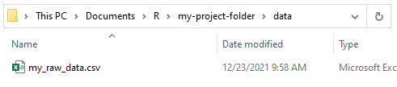

#### Good Coding Practices

##### A note about best practices

As you continue to work in R, your code projects will quickly become bigger and more complex than the examples we've seen this week. The larger the project, the harder it is to keep your thoughts organized when you are working on it - especially if you have to pick it back up after some time away. Fortunately, there are some things you can do to keep your code tidy and understandable.

##### Organize your files

As we learned earlier in this class, you should always use RStudio projects to organize your code projects. If you have a lot of files, it's often helpful to include sub-folders within your project folder for things like raw data and final outputs. Avoid using `setwd()` in your code, as this will likely cause your code to break when it's run from a different computer or user account. Instead, make sure any file paths in your code are relative to the project folder. That means that if you have a folder called `data` inside your project folder, you would just refer to it using the path `./data` (the '.' is shorthand for your current working directory). A file inside the `data` folder called `my_raw_data.csv` would have a relative path of `./data/my_raw_data.csv`.



##### Comment your code

Comments in your code are a gift to your future self and others. You don't need to explain every single line of code, but if it's not obvious what your code is doing, it's a good idea to leave a note. If it took you a while to figure out how to write a chunk of code, or if it was hard to get it to work, that's a good sign that you should take the time to write some comments.

For longer scripts, you can use comments to break your code up into sections (e.g. Setup, Analysis, Plots). It's often helpful to make an outline in comments before you even start coding.

##### Style your code consistently

When writing for an audience, it's helpful to follow a style guide so that inconsistencies and poor grammar don't distract readers from you're trying to say. The National Park Service even has [its own style guide](https://www.nps.gov/subjects/hfc/hfc-editorial-style-guide.htm). The same goes for code. If the "grammar" of your code is tidy and organized, it'll be easier for you and others to focus on what the code actually does.

There are multiple R style guides out there, but the [Tidyverse style guide](https://style.tidyverse.org/) is a good place to start. Using the `styler` package, you can even style your code automatically!

If you find yourself getting bogged down in the finer details of coding style, take a step back and just focus on being generally tidy and consistent. Especially with tools like `styler`, conforming to a style guide shouldn't have to feel like a burden.

##### Be efficient\*

```{r InefficientCode, echo=TRUE, eval=FALSE}
# Retrieve the latest water quality data from the full dataset
pH_2020 <- dplyr::filter(pH_Data_All, WaterYear == 2020)
DissolvedOxygen_2020 <- dplyr::filter(DO_Data_All, WaterYear == 2020)
SpecificConductance_2020 <- dplyr::filter(SpCond_Data_All, WaterYear == 2020)
```

The code above should work fine, assuming that the datasets `pH_Data_All`, `DO_Data_All`, and `SpCond_Data_All` are defined somewhere. But let's imagine what this code would look like if we translated it into an email. It would go something like this:

>*Dear Dr. Hydrologist,*
>
>*I would like a copy of your pH data from 2020. Please send me the pH dataset from 2020. I need your dissolved oxygen data from 2020. Please send me the dissolved oxygen dataset from 2020. I need your specific conductance data from 2020. Please send me the specific conductance dataset from 2020.*
>
>---*An aspiring R programmer*

Well, we certainly got the information across. But our collaborator might look at us funny the next time we see them. We only wanted data from one year, but we wrote it six times! Let's make some minor edits.

>*Dear Dr. Hydrologist,*
>
>*I need a copy of your most current pH, dissolved oxygen, and specific conductance data. Please send me the 2020 datasets for pH, dissolved oxygen, and specific conductance.*
>
>---*An aspiring R programmer*

That's a big improvement. We could keep editing but let's call that good enough for now. Translating back into R code, we get something like this:

```{r EfficientCode, echo=TRUE, eval=FALSE}
current_water_year <- 2020

pH_Current <- dplyr::filter(pH_Data_All, WaterYear == current_water_year)
DissolvedOxygen_Current <- dplyr::filter(DO_Data_All, WaterYear == current_water_year)
SpecificConductance_Current <- dplyr::filter(SpCond_Data_All, WaterYear == current_water_year)
```

Notice how the water year is only specified in one place at the top of the script, instead of being hardcoded in multiple places throughout the code. Not only does this reduce the chance of typos, it makes it much easier to update the water year next year. This doesn't seem like a big deal in an example that's only three lines of code, but imagine having to search through 100 or 1000 lines of code for every occurrence of the current water year or field season. Hardcoding values (e.g. field season, park code) throughout your code, especially when they appear more than once, will cause headaches down the line. Instead, assign values to variables at the top of your code so that you can keep track of them in a single place.

This is an example of the *DRY (Don't Repeat Yourself) Principle*. If you find yourself hardcoding duplicate information (like the water year above) or repeatedly copy-pasting the same piece of code, it's probably worth editing your code to make it less redundant.

\*The caveat: Don't optimize your code too early. As with most types of writing, it's usually best to produce a working draft and *then* edit it until you're satisfied with the result. Trying to get it perfect on the first try usually just leads to [analysis paralysis](https://xkcd.com/1445/)! But the more you practice writing DRY code, the more naturally it will come.

There are a number of ways you can structure your code to make it less redundant and save yourself some work. We'll talk more about this in *Control Structures*.


