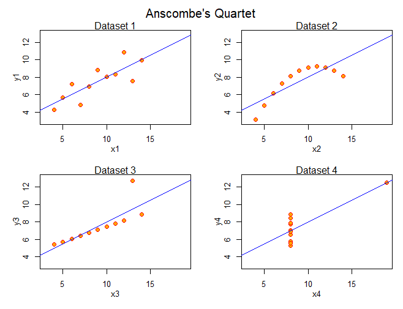

```{r, echo = FALSE, message = FALSE, warning = FALSE}
library(knitr)
library(kableExtra)
library(here)
```

#### Intro to Data Visualizations {.tabset} 

```{r, echo = TRUE, message = FALSE, warning = FALSE}

# Packages used in this tab
library(tidyverse)
library(viridis) # for colorblind-friendly palettes
```

<details open><summary class='drop'>Introduction to Data Visualizations</summary>

Goals of this Day

  1. Learn rules for effective data visualizations
  2. Create simple plots, using base R functions
  3. Create customized and interactive plots, using ggplot functions
  4. Arrange multiple plots on a page, using cowplot and patchwork functions
  5. Create interactive maps, using sf and tmap functions
  
</details>
<br>
<details open><summary class='drop'>The Power of (Good) Data Visualizations</summary>

**Data are useful only when used.** 

<br>
**Data are used only when understood.**

<br>
Consider three examples:

<h3>Example 1. Plots </h3>

Most people can understand this...

<center>![Average daily Covid cases per 100k people, by region (Sources: State and local health agencies [cases]; Census Bureau [population data]](images/covid_by_region.png)</center>

<br>
faster than they can understand this...
```{r, echo = FALSE, message = FALSE, warning = FALSE}
covid_numbers <- readr::read_csv(here::here("Data", "covid_numbers.csv"))
head(covid_numbers, 7) %>%
  knitr::kable(align = "c", caption = "Daily Covid cases and population numbers by state (only showing first 7 records)") %>%
  kableExtra::kable_styling(full_width = F)
```

<h3>Example 2. Plots can reveal patterns and highlight highs and lows.</h3>

This table shows average monthly revenue for Acme products. 

```{r acme_table, echo = FALSE, message = FALSE, warning = FALSE}
acme_in <- read_csv(here::here("Data", "acme_sales.csv")) %>%
  dplyr::arrange(category, product) 
acme_in %>%
  knitr::kable(align = "c", caption = "Average monthly revenue (in $1000's) from Acme product sales, 1950 - 2020") %>%
  kableExtra::kable_styling(full_width = F)
```

Use the table above to answer these questions:

1. What product and month had the highest average monthly revenue?
2. What product and month had the lowest average monthly revenue?

<br>
<details open><summary class='drop2'>Table as Heat Map</summary>
Now let's display the same table as a heat map, with larger numbers represented by darker color cells. Now how quickly can we answer those same two questions? What patterns can we see in the heat map that were not obvious in the table above?

```{r acme_heatmap, echo = FALSE, fig.width = 9, fig.align="center", message = FALSE, warning = FALSE}

acme <- acme_in %>%
  pivot_longer(-c(category, product), names_to = "month", values_to = "revenue")
acme$month <- factor(acme$month, levels = month.abb)

ggplot(acme, aes(x=month, y=product, fill=revenue)) + 
  geom_raster() +
  geom_text(aes(label=revenue, color = revenue > 1250)) + # color of text conditional on revenue relative to 1250
  scale_color_manual(guide = "none", values = c("black", "white")) + # set color of text
  scale_fill_viridis_c(direction = -1, name = "Monthly revenue,\nin $1000's") +
  scale_y_discrete(limits=rev) + # reverses order of y-axis bc ggplot reverses it from the data
  labs(title = "Average monthly revenue (in $1000's) from Acme product sales, 1950 - 2020", x = "Month", y = "Product") + 
  theme_bw(base_size = 12) +
  facet_grid(rows = vars(category), scales = "free") # set scales to free so each facet only shows its own levels
```
</details>
<br>
<h3>Example 3. Plots can reveal patterns that statistics obscure.</h3>

In 1973, Francis Anscombe published ["Graphs in statistical analysis"](https://garstats.files.wordpress.com/2016/08/anscombe-as-1973.pdf), a paper describing four bivariate datasets with identical means, variances, and correlations.

```{r anscombe, echo = FALSE, message = FALSE, warning = FALSE}
ansc <- anscombe %>%
  dplyr::select(x1, y1, x2, y2, x3, y3, x4, y4) 

ansc %>%
  knitr::kable(align = "c", caption = "Anscombe's Quartet - Four bivariate datasets with identical summary statistics") %>%
  kableExtra::column_spec (c(2,4,6),border_left = F, border_right = T) %>%
  kableExtra::kable_styling(full_width = F)

sapply(ansc, function(x) c(mean=round(mean(x), 2), var=round(var(x), 2))) %>%
  knitr::kable(align = "c", caption = "Means and variances are identical in the four datasets. The correlation between x and y (r = 0.82) is also identical across the datasets.") %>%
  kableExtra::column_spec (c(1,3,5,7),border_left = F, border_right = T) %>%
  kableExtra::kable_styling(full_width = F)
```

<br>
<details open><summary class='drop2'>Anscombe data as plots</summary>
Despite their identical statistics, when we actually plot the data we see the four datasets are very different. 

<center>)</center>
 
</details>
<br>
Anscombe's point? TO UNDERSTAND THE DATA, WE MUST PLOT THE DATA!
<br>
</details>
<br>
<details open><summary class='drop'>Rules for Effective Data Visualizations</summary>

Anscombe used clever thinking and simple plots to demonstrate the importance of data visualizations. But it's not enough to just plot the data. To have impact, a plot must convey a clear message. How can we do this?

- **Have a purpose.** Every data visualization should tell a story. What story does the Covid plot tell? What message does Anscombe's quartet of plots convey?

- **Consider your audience.** Avoid scientific names, acronyms, or jargon unless your audience is well-versed in that language. Use color-blind friendly colors.

- **Use an appropriate visualization.** For example: 
  - Line graphs work well for showing changes in continuous data over time 
  - Bar charts compare counts or proportions in categorical data (pie charts get a bad rap in the data viz world, but can be useful in [certain situations](https://chartio.com/learn/charts/what-is-the-difference-between-a-pie-chart-and-a-bar-chart/#:~:text=As%20a%20rule%20of%20thumb%3A%201%20Use%20either,values%20...%203%20Use%20a%20bar%20chart%20otherwise))
  - For statistics (e.g., means) with confidence intervals, point plots with error bars are preferred over bar charts (nice explanation [here](https://scc.ms.unimelb.edu.au/resources-list/graphs-for-statistical-analysis/graphs))
  - Scatterplots are useful for showing the relationship (correlation) between two continuous variables.
  - Matrix heat maps can efficiently compare the magnitude of numbers when we have lots of data structured in table format, especially when colors have a clear connection to the numbers (e.g., scorecard data)
  - Box plots, violin plots, and histograms show distributions and outliers for continuous data. Dot plots are a useful alternative when sample sizes are small.
<br>  
- **Keep it simple!!!**
  - Every plot element and aesthetic should have a purpose.
  - Avoid 3D charts unless you have good reason otherwise.
  - Don't try to cram everything into one plot (e.g., juxtapose two plots instead of adding a secondary y-axis. Nice explanation [here](https://blog.datawrapper.de/dualaxis/)).
<br>  
- **Use informative text and arrows wisely.** Clear, meaningful titles, subtitles, axes titles/labels, and annotations help convey the message of a plot. Use lines and arrows (sparingly but effectively) to emphasize important thresholds, data points or other plot features. Fonts should be large enough with good contrast (against the background) and sufficient white space to be easily readable.
    
</details>
<br>
<details open><summary class='drop'>Let's Start Coding</summary>

For today's data visualizations we will use the [park visits data]("https://github.com/rfordatascience/tidytuesday/tree/master/data/2019/2019-09-17") you're already familiar with from the Data Wrangling module. 

From subsets of the park visits and gas price data, we will create plots to:

- compare the distribution of park visits among years and unit types
- show temporal trends and unusual years in park visit patterns
- show temporal trends in ranking of the top 5 visited park units
- show the relationship between gas price and park visits

<br>
First steps:

1. Import and view the park visits and gas price data
2. Extract a subset of the park visits data to work with
3. Merge in the gas price data
4. Check and clean/tidy the data

<details open><summary class='drop2'>Step 1. Import and view the data</summary>

```{r import_data, echo = TRUE, message = FALSE, warning = FALSE}
park_visits <- read_csv("https://raw.githubusercontent.com/rfordatascience/tidytuesday/master/data/2019/2019-09-17/national_parks.csv") # visits to US National Parks

gas_price <- read_csv("https://raw.githubusercontent.com/rfordatascience/tidytuesday/master/data/2019/2019-09-17/gas_price.csv") # gas prices over space and time
```

View() the data to get an initial sense of what we're working with.

```{r view_data, eval = FALSE, message = FALSE, warning = FALSE}
# Examine the data to understand data structure, data types, and potential problems
View(park_visits); summary(park_visits)
View(gas_price); summary(gas_price)
```

</details>
<details open><summary class='drop2'>Step 2. Extract a subset of data</summary>

Before we run more detailed data checks, let's extract a subset of the `park_visits` data to work with. 

<div class="alert alert-info">
  <strong>CHALLENGE:  Extract a subset of the `park_visits` data</strong>
  
  Create a new data frame that contains a subset of the `park_visits` data. Call the new data frame `park_sub`. We only want to include `park_visits` data that meet these criteria:

  - **region** is IM, PW or SE
  - **unit_type** is National Monument, National Historic Site, or National Park
  - **year** is in the range 2000 - 2015, inclusive
  
  <br>
  We also only need to keep a subset of the data columns from `park_visits`. The new data frame should have these columns (in this order): **region, unit_type, unit_name, unit_code, year, visitors**
  
  <br>
  **Quick Tip!**  
  Even though `park_visits$year` is classified as a character data type, `R` can sort these numbers-as-characters in numeric order. Try running `sort(unique(park_visits$year))` in the console to see for yourself. This means we can filter `park_visits` for a subset of years `"2000":"2015"` without first converting `park_visits$year` to a numeric data type (actually we can even omit the quotes and simply filter for years in `2000:2015`).
</div>

```{r subset_data, echo = FALSE, message = FALSE, warning = FALSE}

# NOTES: 
# 1. When we preface function names with the package name, we avoid potential issues with duplicate function names among packages
# 2. The dplyr::select() function can simultaneously select columns, rename them, and order them as specified. See `?select`

park_sub <- park_visits %>%
  dplyr::filter( 
    region %in% c("IM", "PW", "SE"),
    unit_type %in% c("National Monument", "National Historic Site", "National Park"),
    year %in% 2000:2015) %>% # we would get the same result if we had enclosed the years in quotes, i.e., year %in% "2000":"2015"
  dplyr::select(region, unit_type, unit_name, unit_code, year, visitors) 

# summary(park_sub) # always check the data before and after wrangling!
```

The new data frame should look like this when we type `glimpse(park_sub)` in the console:

```{r check_park_sub, echo = FALSE, message = FALSE, warning = FALSE}
glimpse(park_sub)
```

</details>

</details>
<details open><summary class='drop2'>Step 3. Merge the `gas_constant` data with the `park_sub` data frame</summary>

<div class="alert alert-info">
  <strong>CHALLENGE:  Join the `gas_constant` data (from `gas_price` data frame) to `park_sub`, matching records by year. Call the new data frame `joined_dat`.</strong>
</div>

```{r join_gas, echo = FALSE, results = FALSE, message = FALSE, warning = FALSE}
# `gas_constant` is gas price in constant 2015 dollars/gallon
# Confirm that both data frames have a column called `year` and that the data types match (always check data before and after wrangling!)
glimpse(park_sub) # `year` is a character data type
glimpse(gas_price) # `year` is a double data type (double and numeric data types are equivalent) 

# To join the two data frames by `year`, we need `year` to have the same data type in both data frames. Convert park_sub$year to numeric
park_sub$year <- as.numeric(park_sub$year) # can also use as.double()
class(park_sub$year)

# Confirm that there is one and only one `gas_constant` per year from 2000 to 2015. If there are multiple `gas_constant` values for any year, extra (near-duplicate) rows will be created for that year when we join the data frames 
subset(gas_price, year %in% 2000:2015) # since we're only working with 16 years of data, it's easy enough to check every year

joined_dat <- left_join(park_sub, gas_price[c("year", "gas_constant")], by = "year") # keep all records in park_sub, and add records from gas_price that match by year

dim(park_sub)
dim(joined_dat) # confirm that joined dat has the same number of rows and one extra column than park_sub

summary(joined_dat)
```

The new data frame should show the additional data column `gas_constant` when we type `glimpse(joined_dat)` in the console:

```{r check_plot_dat, echo = FALSE, message = FALSE, warning = FALSE}
glimpse(joined_dat)
```

We now have all the data we need in a single data frame.

</details>
<details open><summary class='drop2'>Step 4. Check and clean/tidy the data</summary>

We are primarily using `dplyr` to wrangle data and `ggplot2` to plot data. These two packages are part of the [Tidyverse](https://www.tidyverse.org/packages/) of packages for data science. Tidyverse packages share a common design philosophy centered on ideas like breaking down complex tasks into a series of simpler functions executed in sequence (e.g., piping `%>%`). Functions from tidyverse packages work together most seamlessly and efficiently when data are in a tidy format. Remember that a 'tidy' format means data have one variable per column and one observation per row. 

<div class="alert alert-info">
  <strong>POLL:  Which of the data sets below is 'tidy'?</strong>
  
  A) Plants that Grow
  <br>
  B) Political Twitter Likes
  <br>
  C) Test Grades and Lunch
  <br>
  D) A & C
  <br>
  E) None of the above
  
</div>

```{r echo = FALSE, message = FALSE, warning = FALSE}
plants <- data.frame(
  plant_id = c(1:4, 1, 2),
  age_days = c(160, 160, 160, 160, 190, 190), 
  height_cm = c(21, 19, 32, 23, 24, 20),
  num_leaves = c(11, 12, 16, 8, 12, 14)
)

twitter_likes <- data.frame(
  political_party = rep(c("Democrat", "Republican", "Independent"), each = 3),
  animal = rep(c("Cat Food Breath", "Doug the Pug", "Jon Pigeon"), times = 3),
  votes = c(5201, 4760, 1200, 6912, 3448, 800, 3722, 2666, 5128)
) %>%
  tidyr::pivot_wider(names_from = animal, values_from = votes)

test_grades <- data.frame(
  student = c("Robin", "Marl", "Randi"),
  before_lunch = c(89, 77, 82),
  after_lunch = c(71, 76, 43)
)
```

```{r echo = FALSE, message = FALSE, warning = FALSE}
# Plants 
knitr::kable(plants, caption = "A) Plants That Grow", align = "c") %>%
  kableExtra::kable_styling(full_width = F)
```

```{r echo = FALSE, message = FALSE, warning = FALSE}
# Twitter Likes
knitr::kable(twitter_likes, caption = "B) Political Twitter Likes", align = "c") %>%
  kableExtra::kable_styling(full_width = F)
```

```{r echo = FALSE, message = FALSE, warning = FALSE}
# Test Grades
knitr::kable(test_grades, caption = "C) Test Grades and Lunch", align = "c") %>%
  kableExtra::kable_styling(full_width = F)
```

What about our `joined_dat` data frame? Is it in 'tidy' format? Yes, it is! No need to pivot_long anything today. But let's make two final changes to the data before we begin plotting. First, we will convert `region` to an ordered factor with more descriptive labels. Second, we will remove park units that don't have visitor data for every year from 2000 to 2015. We will end with a final check of the data to make sure it's ready for plotting.
</details>

<details open><summary class='drop2'>Convert `region` to a factor data type</summary>

Convert the variable `region` to a factor data type and rename and re-order the levels as Pacific West < Intermountain < and Southeast (the default order is alphabetical). This way, bar plots and color legends will order the region levels from west to east instead of alphabetically. 

```{r factor_regions, message = FALSE, warning = FALSE}

# NOTES:
# 1. The factor data type is similar to (and often interchangeable with) the character data type, but limits entries to pre-specified values and allows us to specify an order to those values (other than the default alphabetical order)
# 2. Factors are especially useful for ordered categories (e.g., low < medium < high) with a small number of possible values
# 3. Under the hood, `R` store factors as integer vectors representing the order of the value (with character string labels)
# 4. I usually classify categorical variables as character data types, unless I want to limit entries to a few pre-specified values, or if I want to enforce a particular order to the category levels

unique(joined_dat$region) # check what values are in `region`

joined_dat$region <- 
  factor(joined_dat$region, 
         levels = c("PW", "IM", "SE"), # specifies the factor levels and an order for the levels. If we omit this argument, the factor levels will be the unique set of values in the column, ordered alphabetically
         labels = c("Pacific West", "Intermountain", "Southeast")) # relabels the levels with more descriptive names

# Check the data
glimpse(joined_dat) # `region` is now a factor data type
levels(joined_dat$region) # shows the (renamed) factor levels and their order
str(joined_dat$region) # shows the values are coded as integers indicating factor level order
summary(joined_dat) # the summary for `region` now counts the number of times each factor level occurs
```

</details>
<details open><summary class='drop2'>Remove park units with missing years of data</summary>

We will be creating plots to see if trends in park visits differ by region or unit type, so we want to exclude park units for which we don't have complete data for the years 2000 to 2015. 

Finding which park units have missing years of data is not as simple as filtering for NA's in `joined_dat` because missing park unit-years are not represented by records with `NA` for the visitor count--the missing data are simply not in the data frame.  

We could use tidyr's `expand_grid` function (and then join the template data frame with `joined_dat`) to create the missing records with an `NA` entry for visitors. We would then delete any park units that have at least one `NA` in the `visitors` column. `expand_grid` is a useful function to know because we sometimes need to add in missing records (and, for example, fill in zero values to indicate we went to the site but found zero saplings) so we can get correct summary statistics such as means and standard deviations (that should not be treating zero counts as missing data). 

In our case, we have a simpler option. We can count the unique years of data for each park unit and delete park units that have less than 16 unique years of data. 

(Note that we should also check for park unit-year combinations with multiple records. If these are duplicate records, the duplicates can be deleted. If these records have different visitor counts for the same park unit-year, we would have to find out which record is the "correct" one).

```{r complete_data, message = FALSE, warning = FALSE}

length(2000:2015) # if we can't figure this out in our head, we probably need more sleep. But here is proof that there are 16 years in the range 2000 to 2015, inclusive

# Check if we have multiple records for any combination of unit_code and year (e.g., ARCH should not have multiple records for the year 2016)

# Short example to show how `duplicated` works
test <- data.frame(x = c(1, 1, 3, 2, 2), y = c(7, 2, 4, 1, 1), z = 1:5)
duplicated(test[c("x", "y")])
test[duplicated(test[c("x", "y")]), ]

# Now use `duplicated` on our data
joined_dat[duplicated(joined_dat[c("unit_code", "year")]), ] # good, no duplicates

# Identify park units with less than 16 years of data
remove_units <- joined_dat %>%
  count(unit_code) %>% # count() combines group_by() and summarize(n = n()) in a single function. 
  dplyr::filter(n != 16) # sort the data frame from lowest to highest count of unique years

# View(joined_dat) to check results before you remove these park units from the data

# Remove those park units from the data
viz_dat <- joined_dat %>%
  dplyr::filter(!unit_code %in% remove_units$unit_code)
  
# View(viz_dat) to make sure the park units have been removed. The final data frame should have 1856 rows and 7 columns.
```

```{r save_dat, echo = TRUE, eval = FALSE, warning = FALSE, message = FALSE}
# If you want to save `viz_dat` to your current working directory, run the code below. This code saves `viz_dat` as an .RDS file, which just means it saves it as an `R` object instead of as a .csv file. 

# When we save a data frame as an `R` object we retain the accompanying attribute information (e.g., the order of factor levels for `region`)--this information would not be saved in a .csv file.

saveRDS(viz_dat, "viz_dat.RDS")

# To read the RDS file from your working directory and assign it to `viz_dat`, use the code below. You can assign it to any name you want. If you're reading it from a location other than your working current directory, provide the file path in the function argument.
viz_dat <- readRDS("viz_dat.RDS")
```

Note that a report of our findings should explain how and why we selected this subset of data to work with.

</details>
<details open><summary class='drop2'>Final data check</summary>

Always do a final check of the data to look for missing data, duplicated records, funny numbers or category levels, etc. It helps to create summary tables that decompose the data in various ways. These tables can identify oddities (e.g., category levels with only one record) and also give us an idea of the sample sizes we'll be working with if we create plots with subsets of the data. 

<div class="alert alert-info">
  <strong>CHALLENGE:  Create a table (data frame) that shows the number of park units in each combination of region and. Extra credit if you can reformat the table to wide instead of long format.</strong>
</div>

```{r tab_count, echo = FALSE, results = FALSE, message = FALSE, warning = FALSE}

tab_count <- viz_dat %>% 
  dplyr::distinct(region, unit_type, unit_code) %>%
  dplyr::count(region, unit_type) %>%
  tidyr::pivot_wider(names_from = region, values_from = n)

# View(viz_dat) to double-check the numbers
```


The new data frame (if you have it in wide format) should look like this:

```{r view_tab_count, echo = FALSE, message = FALSE, warning = FALSE}
tab_count
```

We see from this table that we have data for 34 National Monuments in the Intermountain region and that the smallest number of park units in any region-type is 7. We're ready to start plotting.
</details>