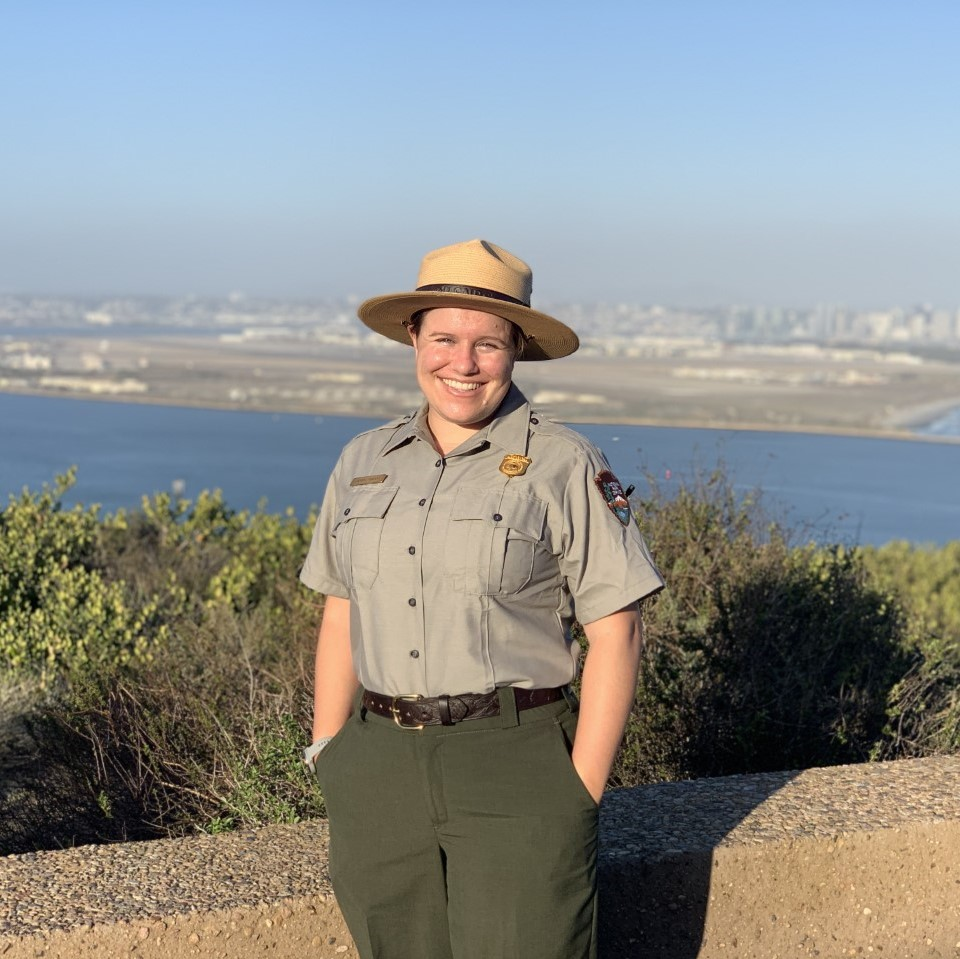

We are the people who designed and led the training for this week. We hope you found it useful, and that you keep with it!  

<b>Andrew Birch</b>  
WRD/IMD Water Quality Program Lead  
andrew_birch@nps.gov  

 
 

<b>Ellen Cheng</b>  
SER Quantitative Ecologist  
ellen_cheng@nps.gov  

 
 

<b>Kate Miller</b>  
NETN/MIDN Quantitative Ecologist  
kathryn_miller@nps.gov  
 
 
 

<b>Lauren Pandori</b>  
CABR Marine Biologist - MEDN  
lauren_pandori@nps.gov  

 
 

<b>Thomas Parr</b>  
GLKN Program Manager  
thomas_parr@nps.gov  
 
 
 

<b>John Paul Schmit</b>  
NCRN Quantitative Ecologist  
john_paul_schmit@nps.gov  

 
 

<b>Sarah Wright</b>   
MOJN Data Scientist  
sarah_wright@nps.gov  

 
 

