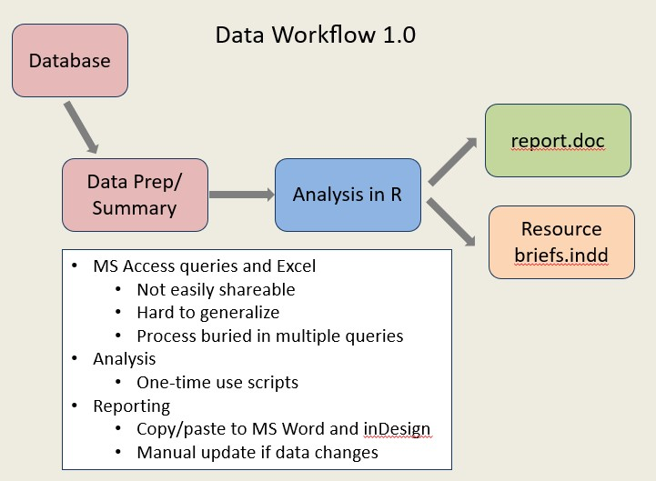
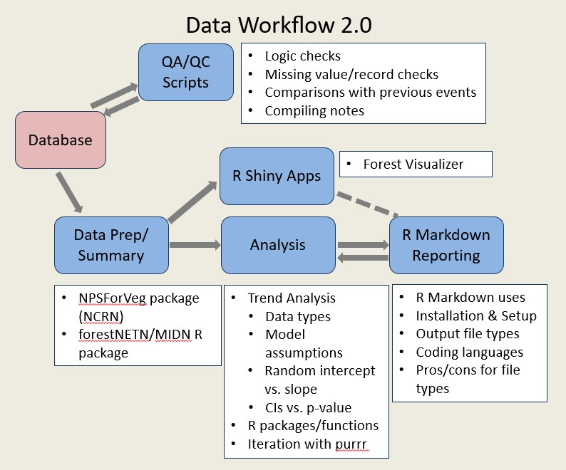

IMD R Training: January 31  -- February 3, 2022 {.tabset .tabset-pills}
--------------------------------------------------
### Prep for Training{.tabset}

```{r Install_instructions, child = "D0_Install_R_and_RStudio.Rmd"}

```

### Day 1{.tabset}

```{r Intro_to_R_tab, child = "D1_M1_Intro_to_R_tab.Rmd"}

```

```{r Project_setup, child = "D1_M2_Variables_and_functions.Rmd"}

```

<!-- ```{r Data_importing_and_subsetting, child = "D1_M6_Importing_and_Subsetting.Rmd"} -->

<!-- ``` -->

<!-- ```{r Types_of_data, child = "D1_M4_Types_of_Data.Rmd"} -->

<!-- ``` -->

<!-- ```{r Data_summary_I, child = "D1_M5_Data_summary_I.Rmd"} -->

<!-- ``` -->

<!-- ```{r Getting_help, child = "D1_M3_Getting_help.Rmd"} -->

<!-- ``` -->

<!-- ```{r D1_Assignments, child = "D1_Reading_Assignments.Rmd"} -->

<!-- ``` -->


<!-- ### Day 2{.tabset} -->
<!-- ```{r Data_wrangling_I, child = "D2_M1_Data_wrangling_I.Rmd"} -->

<!-- ``` -->

<!-- ```{r Joining_dataframes, child = "D2_M3_Joining_dataframes.Rmd"} -->

<!-- ``` -->

<!-- ```{r Data_Summary_II, child = "D2_M4_Data_Summary_II.Rmd"} -->

<!-- ``` -->

<!-- ```{r Saving_data, child = "D2_M5_Saving_data_to_file.Rmd"} -->

<!-- ``` -->

<!-- ```{r D2_Assignments, child = "D2_Reading_Assignments.Rmd"} -->

<!-- ``` -->

<!-- ### Day 3{.tabset} -->

<!-- ```{r Data_wrangling_II, child = "D3_M1_Data_wrangling_II.Rmd"} -->

<!-- ``` -->

<!-- ```{r Plotting_with_ggplot2, child = "D3_M2_Plotting_with_ggplot2.Rmd"} -->

<!-- ``` -->

<!-- ```{r Saving_to_shapefile, child = "D3_M3_Saving_to_shapefile.Rmd"} -->

<!-- ``` -->

<!-- #### The Dream{.tabset} -->
<!-- When I first started with NETN, the workflow below was how we operated. There's no shame in this workflow, and it's still what a lot of networks do. However, it's time-consuming, requires a lot of human intervention where errors can be introduced, and you nearly have to start from scratch every year you need to update your reports or do a new summary.  -->

<!-- <center></center> -->
<!-- <br> -->
<!-- <br> -->
<!-- This is the dream. Again there's no judgment if you're not here. This is something to aspire to, as you have time and gain more skills in R. I'm proud to report that we're really close to achieving this with most of our protocols in NETN, but it's been a long road (4+ years). RStudio has also come a long way in the last 5 years and has made this transition easier with improvements to R Markdown (automated reporting), R Shiny (interactive websites), and the tidyverse.   -->

<!-- <center></center> -->
<!-- <br> -->
<!-- <hr> -->

<!-- ```{r D3_Assignments, child = "D3_Reading_Assignments.Rmd"} -->

<!-- ``` -->
<!-- ### Day 4{.tabset} -->


<!-- ```{r Good_Practices, child= "D4_M1_Good_Practices.Rmd"} -->
<!-- ``` -->

<!-- ```{r Control_Structures, child= "D4_M2_Control_Structures.Rmd"} -->
<!-- ``` -->

<!-- ```{r Troubleshooting_Iteration, child= "D4_M3_Troubleshooting_Iteration.Rmd"} -->
<!-- ``` -->


<!-- ### Useful resources -->
<!-- There's a lot of great online material for learning new applications of R. The ones I've used the most are listed below.  -->

<!-- #### Online Books -->

<!--   - [R for Data Science](https://r4ds.had.co.nz/) First author is Hadley Wickham, the programmer behind the tidyverse. There's a lot of good stuff in here, including a chapter on using R Markdown, which is what was used to generate this website. -->
<!--   - [ggplot2: Elegant Graphics for Data Analysis](https://ggplot2-book.org//) A great reference on ggplot2 also by Hadley Wickham. -->
<!--   - [Mastering Software Development in R](https://bookdown.org/rdpeng/RProgDA/) First author is Roger Peng, a Biostatistics professors at John Hopkins, who has taught a lot of undergrad/grad students how to use R. He's also one of the hosts of Not So Standard Deviations podcast. I like his intro to ggplot a lot. He's also got a lot of more advanced topics in this book, like making functions and packages. -->
<!--   - [R Packages](https://r-pkgs.org/) Another book by Hadley Wickham that teaches you how to build, debug, and test R packages. -->
<!--   - [Advanced R](http://adv-r.had.co.nz/) Yet another book by Hadley Wickham that helps you understand more about how R works under the hood, how it relates to other programming languages, and how to build packages. -->
<!--   - [Mastering Shiny](https://mastering-shiny.org/) And another Hadley Wickham book on building shiny apps. -->

<!-- #### Other useful sites -->

<!--   - [STAT545](https://stat545.com/index.html) Jenny Bryan's site that accompanies the graduate level stats class of the same name. I like that she includes topics on best practices for coding, and not just how to make scripts work. -->
<!--   - [RStudio home page](https://rstudio.com/) There's a ton of info in the Resources tab on this site, including cheatsheets for each package developed by RStudio (ie tidyverse packages), webinars, presentations from past RStudio Conferences, etc. -->
<!--   - [RStudio list of useful R packages by topic](https://support.rstudio.com/hc/en-us/articles/201057987-Quick-list-of-useful-R-packages) -->
<!--   - [Happy Git with R](https://happygitwithr.com/) If you find yourself wanting to go down the path of hosting your code on github, this site will walk you through the process of linking github to RStudio. -->
<!--   - [R-spatial mapping in ggplot](https://www.r-spatial.org/r/2018/10/25/ggplot2-sf.html) The r-spatial.org site is a blog with lots of interesting topics covered. The blog I linked to helped me figure out how to map shapefiles in ggplot. -->

<!-- #### RStudio keyboard shortcuts -->

<!-- Once you get in the swing of coding, you'll find that minimizing the number of times you have to use your mouse will help you code faster. -->
<!-- RStudio has done a great job creating lots of useful keyboard shortcuts designed to keep your hands on the keyboard instead of clicking through menus. -->
<!-- One way to see all of RStudio's built-in shortcuts is to press **Alt+Shift+K**. -->
<!-- A window should appear with a bunch of shortcuts listed. -->
<!-- These are also listed on [RStudio's IDE Cheat Sheet](https://rstudio.com/wp-content/uploads/2016/01/rstudio-IDE-cheatsheet.pdf) -->
<!-- The shortcuts I use the most often are listed below: -->

<!--   - UNDO: Ctrl Z -->
<!--   - REDO: Ctrl Y -->
<!--     - _Note: If Ctrl Y does not work for you in RStudio, go to Tools -> Modify Keyboard Shortcuts. Search for "Yank" and delete the shortcut assignment that uses Ctrl+Y. Search for Redo and make sure that Ctrl+Y is assigned to it._ -->
<!--   - Run highlighted code: Ctrl Enter -->
<!--   - Restart R Session: Ctrl Shift F10 -->
<!--   - Move cursor to Source pane: Ctrl 1 -->
<!--   - Move cursor to Console pane: Ctrl 2 -->
<!--   - Insert pipe (%\>%): Ctrl Shift M -->
<!--   - Insert "\<-" : Alt - -->
<!--   - Zoom in to make text bigger: Ctrl Shift + -->
<!--   - Zoom out: Ctrl - -->
<!--   - Clear console: Ctrl L -->
<!--   - Duplicate line of code: Ctrl Shift D -->
<!--   - Move line of code up or down: Alt arrow up or down -->

<!-- #### Recommended R packages -->

<!--   - [Tidyverse](https://www.tidyverse.org/): A collection of R packages designed for data science.   -->
<!--   `install.packages("tidyverse")` -->
<!--   - [R Markdown](https://rmarkdown.rstudio.com/): Mix narrative text and code in the same document. Outputs include code notebooks, HTML, PDF, Word, and much more.   -->
<!--   `install.packages("rmarkdown")` -->
<!--   - [Styler](https://styler.r-lib.org/): Automatically formats code based on the tidyverse style guide.   -->
<!--   `install.packages("styler")` -->

<!-- ### Answers -->
<!-- ```{r Answers, child = "D1-3_Answers.Rmd"} -->

<!-- ``` -->

<!-- ### Code printout {.tabset} -->
<!-- ```{r Code_printout, child = "D3_Code_Printout.Rmd"} -->

<!-- ``` -->

